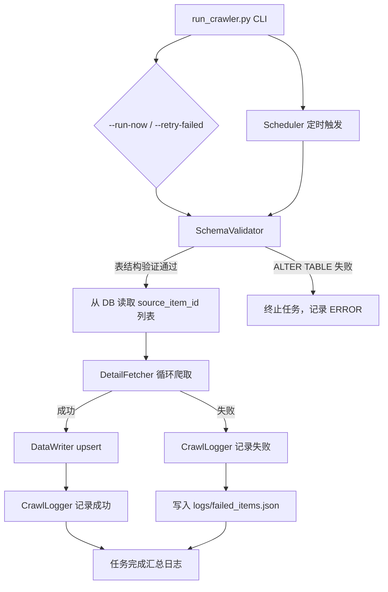
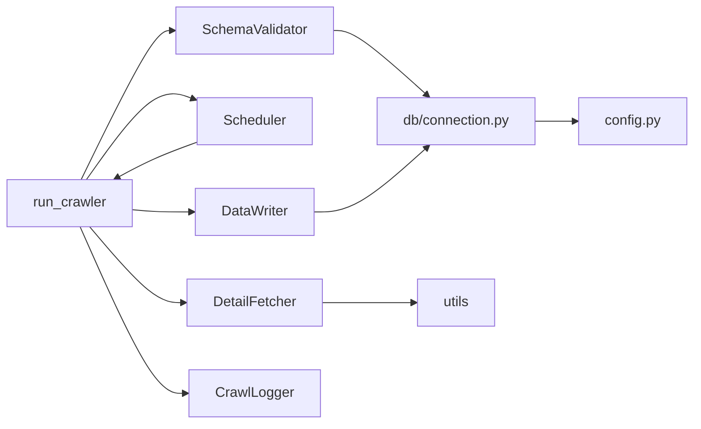

# 技术设计文档：豆瓣爬虫增强（douban-crawler-enhancement）

## 概述

本设计文档描述豆瓣爬虫增强功能的技术实现方案。该功能在现有影视推荐系统基础上新增一个独立的 `crawler/` 模块，负责从豆瓣网页爬取影片/剧集的完整详情字段（导演、主演、剧情简介、地区、语言、时长、集数、热评等），并通过定时任务将数据 upsert 到 PostgreSQL `app.content_items` 表，从而填充前端详情页所需的完整信息。

### 核心设计原则

- **独立模块**：爬虫代码放在项目根目录的 `crawler/` 目录下，不修改现有 `movie_recommendation/` 模块
- **复用基础设施**：复用 `movie_recommendation/config.py` 的数据库配置和 `movie_recommendation/db/connection.py` 的连接逻辑
- **渐进式容错**：单条目失败不影响整批任务，失败条目持久化到 `logs/failed_items.json` 支持重跑
- **轻量调度**：使用 `schedule` 库（已安装）实现定时任务，避免引入重量级依赖

## 架构

### 模块结构

```
crawler/
├── __init__.py
├── run_crawler.py        # 入口脚本（CLI 参数解析、任务编排）
├── schema_validator.py   # SchemaValidator：爬取前验证/补全表结构
├── detail_fetcher.py     # DetailFetcher：HTTP 请求 + HTML 解析
├── data_writer.py        # DataWriter：psycopg3 upsert 到 PostgreSQL
├── crawl_logger.py       # CrawlLogger：日志配置（控制台 + 文件轮转）
├── scheduler.py          # Scheduler：schedule 库定时任务
└── utils.py              # 工具函数（User-Agent 池、延迟、重试装饰器）
```

### 数据流



### 依赖关系



## 组件与接口

### SchemaValidator

**职责**：爬取任务启动前检查 `app.content_items` 表是否包含所有目标字段，缺失时自动执行 `ALTER TABLE ADD COLUMN IF NOT EXISTS`。

**目标字段列表**：`director`、`actors`、`year`、`region`、`language`、`duration`、`episodes`、`plot`、`raw_source`（JSONB）

**接口**：

- `validate_and_patch() -> None`：检查所有字段，缺失时执行 ALTER TABLE，失败时抛出 `SchemaValidationError`
- `SchemaValidationError`：ALTER TABLE 执行失败时抛出，调用方捕获后终止任务

**实现细节**：通过查询 `information_schema.columns` 获取现有字段列表，对每个缺失字段执行：

```sql
ALTER TABLE app.content_items ADD COLUMN IF NOT EXISTS <col> <type>
```

---

### DetailFetcher

**职责**：请求单个豆瓣条目页面（详情页 + 热评页），解析 HTML 提取所有目标字段。

**数据结构**：

- `ReviewItem`：author(str)、content(str)、rating(Optional[int] 1-5)、date(str YYYY-MM-DD)
- `FetchResult`：source_item_id、content_type、director、actors、year、region、language、duration、episodes、plot、reviews(list[ReviewItem])、success(bool)、error(Optional[str])

**接口**：

- `fetch(source_item_id, content_type) -> FetchResult`：请求详情页和热评页，内部处理随机 UA、随机延迟、指数退避重试
- `_parse_detail(html, content_type) -> dict`：解析详情页 HTML
- `_parse_reviews(html) -> list[ReviewItem]`：解析热评页 HTML

---

### DataWriter

**职责**：将 FetchResult 列表 upsert 到 `app.content_items` 表。

**接口**：

- `write_batch(results) -> tuple[int, int]`：批量 upsert，返回 (成功数, 失败数)，单条失败不回滚整批
- `write_one(result) -> bool`：写入单条，返回是否成功

---

### CrawlLogger

**职责**：配置日志（控制台 + RotatingFileHandler），提供结构化的任务日志方法。

**接口**：

- `task_start(content_type, total)`：记录任务开始时间、内容类型、条目总数
- `item_success(source_item_id, title, elapsed)`：记录单条成功
- `item_failure(source_item_id, reason, retries)`：记录单条失败
- `task_end(success, failed, elapsed, failed_ids)`：记录任务汇总，列出所有失败 ID

**日志配置**：RotatingFileHandler，maxBytes=10MB，backupCount=5，日志级别通过 `LOG_LEVEL` 环境变量配置。

---

### Scheduler

**职责**：使用 `schedule` 库按配置时间定时触发爬取任务，支持任务锁防止并发。

**接口**：

- `start()`：阻塞运行，按 CRAWLER_RUN_TIME 定时触发
- `_is_running() -> bool`：通过 threading.Event 检查上一次任务是否仍在运行

**调度配置**：通过环境变量 `CRAWLER_RUN_TIME`（格式 HH:MM，默认 02:00）配置每日触发时间：

```python
run_time = os.getenv("CRAWLER_RUN_TIME", "02:00")
schedule.every().day.at(run_time).do(job)
```

---

### utils.py

**职责**：提供 User-Agent 池、随机延迟、指数退避重试装饰器。

**User-Agent 池**（6个主流浏览器标识）：Chrome/Windows、Chrome/macOS、Firefox/Windows、Safari/macOS、Chrome/Linux、Edge/Windows。

**函数**：

- `random_ua() -> str`：从池中随机返回一个 UA
- `random_delay(min_s=1.0, max_s=3.0)`：随机等待 [min_s, max_s] 秒
- `retry_with_backoff(max_retries=3, base_delay=2.0)`：指数退避重试装饰器，第 n 次重试前等待 `base_delay * 2^(n-1)` 秒，HTTP 429 时额外等待 60 秒

## 数据模型

### 豆瓣 HTML 解析选择器

#### 详情页（`https://movie.douban.com/subject/{id}/`）

豆瓣详情页的核心信息位于 `#info` 区块，使用 BeautifulSoup 解析：

| 字段 | 选择器 / 解析方式 |
|------|-----------------|
| 导演 | `#info span:contains("导演") ~ span.attrs a` → 提取所有 `<a>` 文本，以 "/" 拼接 |
| 主演 | `#info span.actor span.attrs a` → 提取前5个 `<a>` 文本，以 "/" 拼接 |
| 年份 | `span.year` → 提取文本，正则 `\d{4}` 匹配4位数字，转 int |
| 制片地区 | `#info span:contains("制片国家/地区")` 后的文本节点 |
| 语言 | `#info span:contains("语言")` 后的文本节点 |
| 时长（电影）| `#info span:contains("片长")` 后的文本节点 |
| 集数（剧集）| `#info span:contains("集数")` 后的文本节点 |
| 剧情简介 | `div.related-info div.indent span.all` 或 `div.related-info div.indent` 的文本内容 |

**解析示例**（导演字段）：

```python
info_div = soup.find('div', id='info')
# 找到包含"导演"文字的 span，取其后的 span.attrs 中的所有 a 标签
directors = []
for span in info_div.find_all('span', class_='pl'):
    if '导演' in span.text:
        attrs_span = span.find_next_sibling('span', class_='attrs')
        if attrs_span:
            directors = [a.text.strip() for a in attrs_span.find_all('a')]
        break
director = '/'.join(directors) if directors else None
```

#### 热评页（`https://movie.douban.com/subject/{id}/comments?status=P&sort=new_score`）

| 字段 | 选择器 |
|------|--------|
| 评论容器 | `div#comments div.comment-item`（取前5个） |
| 作者 | `.comment-item .avatar a` 的 `title` 属性 |
| 评论内容 | `.comment-item .comment-content span.short` 的文本 |
| 评分 | `.comment-item .rating` 的 `class` 属性，如 `allstar40` → 4 星；缺失时为 None |
| 日期 | `.comment-item .comment-time` 的文本，正则 `\d{4}-\d{2}-\d{2}` 提取 |

**评分解析**：

```python
rating_span = comment.find('span', class_=lambda c: c and c.startswith('allstar'))
if rating_span:
    # allstar10=1, allstar20=2, allstar30=3, allstar40=4, allstar50=5
    cls = [c for c in rating_span['class'] if c.startswith('allstar')][0]
    rating = int(cls.replace('allstar', '')) // 10
else:
    rating = None
```

---

### raw_source JSONB 结构

`raw_source` 字段存储爬虫抓取的扩展数据，合并策略为**保留已有键，只更新 `reviews` 键**：

```json
{
  "reviews": [
    {
      "author": "用户名",
      "content": "评论内容",
      "rating": 4,
      "date": "2024-01-15"
    }
  ]
}
```

**upsert 时的合并 SQL**：

```sql
INSERT INTO app.content_items (
    source_item_id, content_type, title, director, actors, year,
    region, language, duration, episodes, plot, raw_source, updated_at
) VALUES (
    %(source_item_id)s, %(content_type)s, %(title)s, %(director)s,
    %(actors)s, %(year)s, %(region)s, %(language)s, %(duration)s,
    %(episodes)s, %(plot)s, %(raw_source)s, CURRENT_TIMESTAMP
)
ON CONFLICT (source_item_id, content_type)
DO UPDATE SET
    director   = EXCLUDED.director,
    actors     = EXCLUDED.actors,
    year       = EXCLUDED.year,
    region     = EXCLUDED.region,
    language   = EXCLUDED.language,
    duration   = EXCLUDED.duration,
    episodes   = EXCLUDED.episodes,
    plot       = EXCLUDED.plot,
    raw_source = COALESCE(app.content_items.raw_source, '{}'::jsonb)
                 || EXCLUDED.raw_source,
    updated_at = CURRENT_TIMESTAMP
```

> **说明**：使用 PostgreSQL `||` 运算符合并 JSONB，`COALESCE` 处理 raw_source 为 NULL 的情况。这样已有的其他键（如 `douban_raw`）会被保留，只有 `reviews` 键被更新。

---

### 失败条目持久化格式

失败条目存储在 `logs/failed_items.json`，格式如下：

```json
{
  "last_run": "2024-01-15T02:05:30",
  "failed_items": [
    {
      "source_item_id": "1234567",
      "content_type": "movie",
      "title": "电影名称",
      "reason": "HTTP 403 Forbidden",
      "retries": 3,
      "timestamp": "2024-01-15T02:03:15"
    }
  ]
}
```

---

### 命令行接口设计

入口脚本 `crawler/run_crawler.py` 支持以下参数：

```
usage: run_crawler.py [-h] [--run-now] [--type {movie,series,all}]
                      [--limit N] [--retry-failed]

options:
  --run-now          立即触发一次爬取，不等待定时调度
  --type             指定爬取内容类型：movie / series / all（默认 all）
  --limit N          限制本次爬取的最大条目数（用于测试）
  --retry-failed     仅重新爬取上次失败的条目（从 logs/failed_items.json 读取）
```

**示例**：

```bash
# 立即爬取所有内容
python crawler/run_crawler.py --run-now

# 仅爬取电影，限制10条（测试用）
python crawler/run_crawler.py --run-now --type movie --limit 10

# 重跑上次失败的条目
python crawler/run_crawler.py --retry-failed

# 启动定时调度（阻塞运行）
python crawler/run_crawler.py
```

---

### 环境变量配置

| 变量名 | 默认值 | 说明 |
|--------|--------|------|
| `CRAWLER_RUN_TIME` | `02:00` | 每日定时爬取时间（HH:MM 格式） |
| `LOG_LEVEL` | `INFO` | 日志级别（DEBUG/INFO/WARNING/ERROR） |
| `DATABASE_URL` | — | PostgreSQL 连接 URL（复用现有配置） |
| `PGSCHEMA` | `app` | 数据库 schema 名称 |


## 正确性属性

*属性是在系统所有有效执行中都应成立的特征或行为——本质上是关于系统应该做什么的形式化陈述。属性是人类可读规范与机器可验证正确性保证之间的桥梁。*

### 属性 1：SchemaValidator 识别所有缺失字段

*对于任意* 已存在字段的子集，SchemaValidator 应能正确识别出所有不在该子集中的目标字段，并将其标记为需要补充的字段。

**验证：需求 0.1**

---

### 属性 2：主演列表截断

*对于任意* 包含 N 个主演的 HTML 片段（N >= 0），DetailFetcher 解析后返回的主演数量应不超过 5，且当 N >= 5 时恰好返回前 5 位，以 "/" 分隔。

**验证：需求 1.2**

---

### 属性 3：热评列表截断

*对于任意* 包含 N 条热评的 HTML 片段（N >= 0），DetailFetcher 解析后返回的热评数量应不超过 5。

**验证：需求 1.5**

---

### 属性 4：可选字段缺失时返回 null

*对于任意* 缺少某个可选字段（duration、episodes、region、language 之一）的详情页 HTML，DetailFetcher 应将该缺失字段返回为 None，且其他字段的解析结果不受影响。

**验证：需求 1.7**

---

### 属性 5：User-Agent 来自预定义池

*对于任意* 次 HTTP 请求，DetailFetcher 使用的 User-Agent 字符串应来自预定义的 USER_AGENTS 池，且该池中至少包含 5 个不同的字符串。

**验证：需求 2.1**

---

### 属性 6：请求间延迟在合法范围内

*对于任意* 次成功的条目页面请求，DetailFetcher 在发起下一次请求前等待的时间应在 [1.0, 3.0] 秒范围内。

**验证：需求 2.2**

---

### 属性 7：指数退避重试

*对于任意* 次请求失败序列，DetailFetcher 的重试等待时间应满足指数退避规律：第 1 次重试前等待约 2 秒，第 2 次约 4 秒，第 3 次约 8 秒，且总重试次数不超过 3 次。

**验证：需求 2.3**

---

### 属性 8：upsert 正确性

*对于任意* 一批 FetchResult，DataWriter 执行 upsert 后：
- 若记录已存在，则 director、actors、year、region、language、duration、episodes、plot、raw_source、updated_at 字段应被更新为新值
- 若记录不存在，则应插入包含所有字段的完整新记录

**验证：需求 3.2、3.3**

---

### 属性 9：热评写入 raw_source.reviews

*对于任意* 包含热评列表的 FetchResult，DataWriter 写入后，从数据库读取的 `raw_source['reviews']` 应与输入的热评列表结构一致（author、content、rating、date 字段均正确）。

**验证：需求 3.4**

---

### 属性 10：--limit 参数限制爬取数量

*对于任意* 正整数 N，当使用 `--limit N` 参数运行爬虫时，实际爬取的条目数量应不超过 N。

**验证：需求 4.6**

---

### 属性 11：错误隔离与失败汇总

*对于任意* 包含部分失败条目的爬取批次，Crawler 应：
1. 捕获每个失败条目的异常，继续处理后续条目，不中断整批任务
2. 在任务结束日志中列出所有失败条目的 source_item_id，且列表与实际失败条目完全一致

**验证：需求 6.1、6.2**


## 错误处理

### 错误分类与处理策略

| 错误类型 | 发生位置 | 处理方式 |
|---------|---------|---------|
| ALTER TABLE 失败 | SchemaValidator | 抛出 SchemaValidationError，调用方终止任务，记录 ERROR 日志 |
| HTTP 网络异常 | DetailFetcher | 指数退避重试最多3次，耗尽后记录失败，继续下一条目 |
| HTTP 429 | DetailFetcher | 额外等待60秒后重试（计入重试次数） |
| HTTP 403/404 | DetailFetcher | 不重试，直接记录失败（页面不存在或被封禁） |
| HTML 解析异常 | DetailFetcher._parse_detail | 捕获异常，对应字段返回 None，记录 WARNING |
| 数据库写入异常 | DataWriter.write_one | 捕获异常，记录 ERROR，继续处理下一条，不回滚整批 |
| 未预期异常 | Crawler 主循环 | 捕获所有 Exception，记录 ERROR，继续下一条目 |

### 失败条目持久化

每次任务结束后，将失败条目写入 `logs/failed_items.json`（覆盖写入，保留最近一次失败列表）。`--retry-failed` 参数读取该文件，仅对失败条目重新爬取。

### 数据库连接失败

若 SchemaValidator 或 DataWriter 无法建立数据库连接，任务立即终止并记录 ERROR 日志，不进行任何爬取。

---

## 测试策略

### 测试框架

- **单元测试 / 属性测试**：`pytest` + `hypothesis`（属性测试库）
- **测试目录**：`crawler/tests/`
- **Mock 工具**：`unittest.mock`（mock HTTP 请求、数据库连接、time.sleep）

### 属性测试配置

每个属性测试使用 `hypothesis` 库，最少运行 100 次迭代：

```python
from hypothesis import given, settings
from hypothesis import strategies as st

@settings(max_examples=100)
@given(st.lists(st.text(min_size=1), min_size=0, max_size=20))
def test_property_2_actors_truncation(actor_names):
    # Feature: douban-crawler-enhancement, Property 2: 主演列表截断
    html = build_actors_html(actor_names)
    result = parse_actors(html)
    assert len(result.split('/')) <= 5
```

### 单元测试覆盖

**SchemaValidator 测试**（`tests/test_schema_validator.py`）：
- 属性 1：生成随机字段子集，验证缺失字段识别正确
- 边界：ALTER TABLE 失败时抛出 SchemaValidationError
- 边界：raw_source 类型不符时记录 WARNING 不抛出异常

**DetailFetcher 测试**（`tests/test_detail_fetcher.py`）：
- 属性 2：生成 0-20 个主演的 HTML，验证截断逻辑
- 属性 3：生成 0-10 条热评的 HTML，验证截断逻辑
- 属性 4：生成缺少不同可选字段的 HTML，验证 None 返回
- 属性 5：多次调用，验证 UA 来自预定义池
- 属性 6：mock time.sleep，验证延迟在 [1, 3] 秒
- 属性 7：mock requests 始终失败，验证重试次数和等待时间
- 边界：HTTP 429 时额外等待 60 秒
- 边界：3次重试后仍失败，返回 FetchResult(success=False)

**DataWriter 测试**（`tests/test_data_writer.py`）：
- 属性 8：生成随机 FetchResult，验证 upsert 的 INSERT 和 UPDATE 分支
- 属性 9：生成随机热评列表，验证 raw_source.reviews 结构
- 边界：单条写入失败时，其他条目正常写入

**Crawler 集成测试**（`tests/test_crawler_integration.py`）：
- 属性 10：生成随机 limit 值，验证实际爬取数量不超过 limit
- 属性 11：mock 部分条目失败，验证错误隔离和失败汇总

**CrawlLogger 测试**（`tests/test_crawl_logger.py`）：
- 验证 RotatingFileHandler 配置（maxBytes=10MB，backupCount=5）
- 验证同时输出到控制台和文件

### 集成测试

使用真实 PostgreSQL 测试数据库（通过 `PGDATABASE=test_db` 环境变量隔离）：
- SchemaValidator 执行 ALTER TABLE 的完整流程
- DataWriter upsert 的端到端验证
- 完整爬取任务的端到端验证（使用 mock HTTP 响应）

### 测试数据生成

使用 `hypothesis` 策略生成测试数据：

```python
# 生成随机 FetchResult
fetch_result_strategy = st.builds(
    FetchResult,
    source_item_id=st.text(min_size=1, max_size=20),
    content_type=st.sampled_from(['movie', 'series']),
    director=st.one_of(st.none(), st.text(min_size=1)),
    actors=st.one_of(st.none(), st.text(min_size=1)),
    year=st.one_of(st.none(), st.integers(min_value=1900, max_value=2030)),
    # ...
)
```
