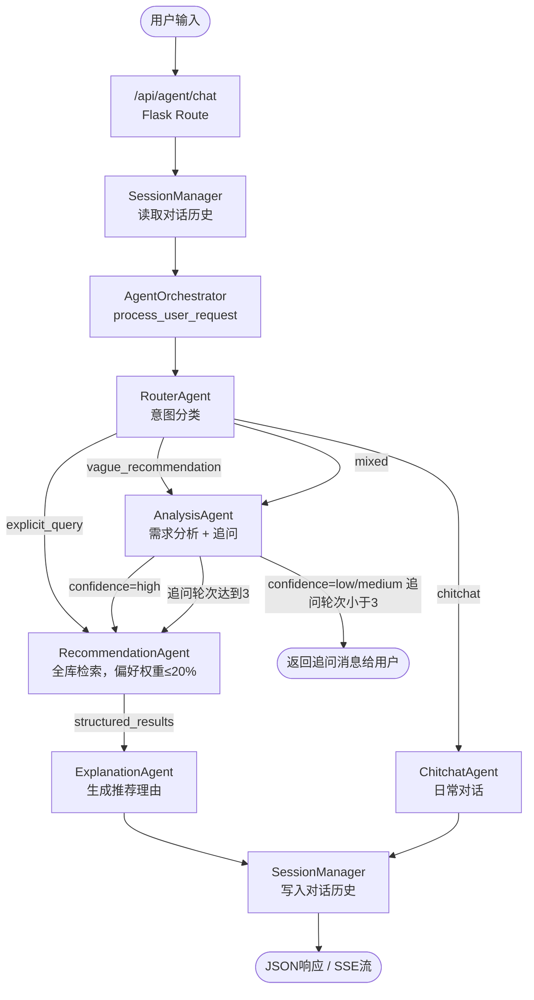

# 技术设计文档：多 Agent 协作推荐架构

## 概述

本文档描述将现有影视推荐系统的单一 AgentManager 升级为多 Agent 协作架构的技术方案。

**改造背景**：现有线性链路 NLUProcessor -> ToolOrchestrator -> ResponseGenerator 存在两个核心问题：NLU 被动解析无法主动追问，以及推荐策略单一导致明确查询场景下偏好干扰过强。

**改造目标**：引入 Router Agent、Analysis Agent、Recommendation Agent、Explanation Agent、Chitchat Agent 五个职责单一的 Agent，通过 AgentOrchestrator 统一编排，在保持 API 向后兼容的前提下解决上述问题。

---

## 架构

### 多 Agent 协作调用链



### 模块职责与文件映射

| Agent | 新建文件 | 对应现有文件 | 处理方式 |
|---|---|---|---|
| AgentOrchestrator | `agent/orchestrator.py` | `agent/recommendation_agent.py` | 替换 AgentManager |
| RouterAgent | `agent/agents/router_agent.py` | `agent/agent_core/nlu_processor.py` | 替换（路由职责） |
| AnalysisAgent | `agent/agents/analysis_agent.py` | `agent/agent_core/nlu_processor.py` | 替换（理解职责） |
| RecommendationAgent | `agent/agents/recommendation_agent.py` | `tool_orchestrator.py` + `response_generator.py` | 重构合并 |
| ExplanationAgent | `agent/agents/explanation_agent.py` | `explain/explanation_generator.py` | 包装复用 |
| ChitchatAgent | `agent/agents/chitchat_agent.py` | `AgentManager._handle_chitchat` | 提取独立 |
| SessionManager | `agent/session_manager.py` | 同左 | 直接复用，不修改 |
| LLM 客户端 | `ai_config/llm_client.py` | 同左 | 直接复用，不修改 |
| API 路由 | `api/routes.py` | 同左 | 仅替换导入，不修改接口 |

---

## 组件与接口设计

### 1. StructuredContext 数据结构

Analysis Agent 输出的结构化需求上下文，贯穿整个 Agent 链路：

```python
@dataclass
class StructuredContext:
    intent: str           # recommend_movie / recommend_series / search_content / get_detail
    confidence: str       # high / medium / low
    mood: str             # 情绪描述，如"轻松解压"，无则空字符串
    genres: list[str]     # 类型列表，如 ["喜剧", "动画"]
    keywords: list[str]   # 关键词，如 ["父女情", "末日"]
    directors: list[str]  # 导演列表
    actors: list[str]     # 演员列表
    content_type: str     # movie / series / ""（不限）
    context: str          # 场景描述，如"用户压力大，需要治愈系内容"
    skip_preference_injection: bool  # True 时推荐 Agent 不强制注入用户偏好
    clarify_question: str # 非空时表示需要向用户追问，内容为追问文本
    clarify_round: int    # 当前追问轮次，最大 3
```

### 2. AgentOrchestrator（agent/orchestrator.py，新建）

替换现有 `AgentManager`，提供完全相同的方法签名：

```python
class AgentOrchestrator:
    def __init__(self):
        self.router = RouterAgent()
        self.analyzer = AnalysisAgent()
        self.recommender = RecommendationAgent()
        self.explainer = ExplanationAgent()
        self.chitchatter = ChitchatAgent()

    def process_user_request(
        self,
        user_id: str,
        user_message: str,
        preference_context: Optional[dict] = None,
        session_id: Optional[str] = None,
        stream: bool = False,
    ) -> tuple[str | Generator, list, str]:
        """
        与现有 AgentManager.process_user_request 签名完全一致。
        返回 (nl_response, structured_results, session_id)
        """
```

**编排逻辑**：

```
1. SessionManager.get_or_create(session_id) → 获取历史
2. RouterAgent.route(user_message, history) → intent_type
3. if intent_type == "chitchat":
       ChitchatAgent.chat(user_message, history) → nl_response
       return nl_response, [], session_id
4. if intent_type == "explicit_query":
       ctx = StructuredContext(skip_preference_injection=True, confidence="high", ...)
       直接进入步骤 6
5. if intent_type in ("vague_recommendation", "mixed"):
       ctx = AnalysisAgent.analyze(user_message, history, clarify_round)
       if ctx.clarify_question:
           SessionManager.append(user_message, ctx.clarify_question)
           return ctx.clarify_question, [], session_id  # 追问轮，不调用推荐
6. results = RecommendationAgent.execute(user_id, ctx, preference_context, messages)
7. nl_response = RecommendationAgent.generate_response(results, ctx, stream)
8. results = ExplanationAgent.explain(results, ctx)
9. SessionManager.append(user_message, nl_response)
10. return nl_response, results, session_id
```

---

### 3. RouterAgent（agent/agents/router_agent.py，新建）

**职责**：单次 LLM 调用，将用户输入分类为四种意图类型之一。

**接口**：

```python
class RouterAgent:
    def route(self, user_message: str, history: list) -> str:
        """
        返回意图类型：
        - explicit_query：明确查询，如"最近高分电影"、"有什么喜剧推荐"、"某片讲的是什么"
        - vague_recommendation：模糊推荐，如"给我推荐点什么"、"今晚看什么好"
        - mixed：混合，如"推荐一部好看的电影"
        - chitchat：闲聊，与影视无关
        """
```

**System Prompt**：

```
你是影视推荐系统的意图路由模块。分析用户输入，返回以下四种意图类型之一（严格返回单个词，不含其他文字）：

- explicit_query：用户有明确的查询条件，如指定评分要求（高分、最近热门）、指定类型（喜剧、科幻）、指定片名、询问某片详情
- vague_recommendation：用户没有明确条件，泛泛地想要推荐，如"给我推荐点什么"、"今晚看什么好"
- mixed：用户有部分条件但不够具体，如"推荐一部好看的电影"、"有什么好看的剧"
- chitchat：与影视推荐无关的日常对话

判断规则：
1. 含有"高分"、"最近"、"热门"、"评分"等客观筛选词 → explicit_query
2. 含有具体类型词（喜剧、科幻、悬疑等）且无其他模糊修饰 → explicit_query
3. 含有具体片名或询问某片内容 → explicit_query
4. 完全没有条件的推荐请求 → vague_recommendation
5. 有条件但条件模糊（"好看的"、"不错的"）→ mixed
```

**降级**：LLM 调用失败时返回 `"vague_recommendation"`。

---

### 4. AnalysisAgent（agent/agents/analysis_agent.py，新建）

**职责**：深度理解用户需求，必要时追问，输出 StructuredContext。

**接口**：

```python
class AnalysisAgent:
    def analyze(
        self,
        user_message: str,
        history: list,
        clarify_round: int = 0,
    ) -> StructuredContext:
        """
        分析用户需求，返回 StructuredContext。
        若 ctx.clarify_question 非空，表示需要向用户追问。
        clarify_round >= 3 时强制输出，不再追问。
        """
```

**System Prompt**：

```
你是影视推荐系统的需求分析模块。分析用户的推荐需求，评估清晰度，必要时生成追问。

严格返回 JSON，格式如下：
{
  "intent": "recommend_movie",
  "confidence": "high",
  "mood": "轻松解压",
  "genres": ["喜剧", "动画"],
  "keywords": [],
  "directors": [],
  "actors": [],
  "content_type": "movie",
  "context": "用户压力大，需要治愈系内容",
  "clarify_question": ""
}

confidence 评估规则：
- high：用户明确说明了类型、情绪或具体需求，可以直接推荐
- medium：有部分信息但不够完整
- low：几乎没有有效信息，如仅说"推荐电影"

clarify_question 规则：
- confidence=low 时，生成 1-2 个追问问题，合并为一句话，如"您想看什么类型的？最近心情怎么样？"
- confidence=medium 时，可选择追问最关键的缺失信息
- confidence=high 时，clarify_question 必须为空字符串
- 已追问 2 轮以上时，clarify_question 必须为空字符串（强制输出结果）

注意：
- genres 使用中文类型名：科幻、动作、喜剧、爱情、悬疑、恐怖、动画、纪录片、剧情、犯罪、惊悚
- mood 描述情绪需求：轻松、感动、刺激、治愈、烧脑、温暖
- context 用一句话描述用户的场景和需求背景
```

**追问轮次控制**：`clarify_round` 由 `AgentOrchestrator` 维护，存储在 session 的元数据中。达到 3 轮时，Orchestrator 在调用前将 `clarify_round=3` 传入，Analysis Agent 的 Prompt 中包含"已追问 2 轮以上"的规则，强制输出结果。

---

### 5. RecommendationAgent（agent/agents/recommendation_agent.py，新建）

**职责**：基于 StructuredContext 执行 Function Calling 工具调用，并生成自然语言回复。整合现有 `ToolOrchestrator` 和 `ResponseGenerator` 的功能。

**接口**：

```python
class RecommendationAgent:
    def execute(
        self,
        user_id: str,
        ctx: StructuredContext,
        preference_context: Optional[dict],
        messages: list,
    ) -> list[dict]:
        """执行工具调用，返回推荐结果列表（去重）"""

    def generate_response(
        self,
        results: list[dict],
        ctx: StructuredContext,
        stream: bool = False,
    ) -> str | Generator:
        """生成自然语言回复"""
```

**动态推荐策略**：

```
if ctx.skip_preference_injection:
    # explicit_query 路径：全库检索
    - System Prompt 中明确指示：不要调用 get_user_preference 工具
    - 工具调用优先级：search_content（按评分/热度排序）> semantic_search
    - 用户偏好仅作为 response 生成时的参考，不影响检索
    - SQL 排序：ORDER BY rating DESC, popularity DESC

else:
    # vague_recommendation 路径：个性化检索
    - System Prompt 中指示：优先调用 get_user_preference 获取偏好
    - 工具调用优先级：get_user_preference → semantic_search / search_content（带偏好过滤）
    - 偏好作为主要过滤条件
```

**工具 Schema**（复用现有 5 个工具，新增排序参数）：

在现有 `search_content` 工具的 parameters 中新增：
```json
"sort_by": {
    "type": "string",
    "enum": ["rating", "popularity", "relevance"],
    "default": "relevance",
    "description": "排序方式：rating 按评分降序，popularity 按热度降序，relevance 按相关性"
}
```

**explicit_query 路径的 System Prompt 补充**：

```
当前为明确查询模式。规则：
1. 不要调用 get_user_preference 工具
2. 使用 search_content 时，sort_by 参数优先选择 "rating" 或 "popularity"
3. 推荐结果以客观质量（评分、热度）为主要依据
4. 在回复中不要提及用户的历史偏好
```

**降级**：所有工具调用返回空时，执行无过滤条件的全库热门内容兜底查询（`ORDER BY popularity DESC LIMIT 10`）。

---

### 6. ExplanationAgent（agent/agents/explanation_agent.py，新建）

**职责**：包装现有 `ExplanationGenerator`，结合 StructuredContext 的 `mood` 和 `context` 字段生成更贴切的推荐理由。

**接口**：

```python
class ExplanationAgent:
    def explain(
        self,
        results: list[dict],
        ctx: StructuredContext,
    ) -> list[dict]:
        """为每条推荐结果添加 explanation 字段"""
```

**System Prompt 改进**（在现有基础上增加 mood/context 感知）：

```
请为以下影视推荐生成个性化推荐理由（每条 1-2 句，20-50 字）。

用户当前需求背景：{context}
用户情绪状态：{mood}

要求：
- 若 mood 非空，推荐理由中体现情绪契合度，如"适合今晚放松心情"
- 若 context 非空，结合场景信息，如"适合和家人一起观看"
- 优先突出与用户需求最相关的影视特征
- 语言自然亲切，不要像广告词

返回 JSON 数组：[{"id": 1, "explanation": "..."}, ...]
```

**降级**：LLM 失败时调用现有 `ExplanationGenerator._template_explanation` 方法。

---

### 7. ChitchatAgent（agent/agents/chitchat_agent.py，新建）

**职责**：处理闲聊，提取自现有 `AgentManager._handle_chitchat`。

**接口**：

```python
class ChitchatAgent:
    def chat(self, message: str, history: list) -> str:
        """返回闲聊回复，不超过 150 字"""
```

**System Prompt**：

```
你是一个友好的影视推荐助手，用简短自然的中文回复用户的闲聊（不超过 150 字）。
如果用户聊到影视相关话题，自然地引导他们提出具体推荐需求。
不要调用任何工具，不要主动推荐具体影视。
```

**降级**：LLM 失败时返回固定文本："您好！我是影视推荐助手，可以为您推荐电影或剧集。请告诉我您的喜好！"

---

## Session 管理

### 复用现有 SessionManager

`SessionManager` 直接复用，不做任何修改。AgentOrchestrator 在 session 的 history 中额外维护一个元数据条目，用于追踪追问轮次：

```python
# session 元数据存储在 _sessions[session_id] 的顶层字段
_sessions[session_id]["clarify_round"] = 0  # 追问轮次，由 Orchestrator 维护
```

追问轮次的生命周期：用户发起新的推荐请求（非追问回答）时重置为 0。判断依据：Router Agent 返回非 `chitchat` 且当前 session 上一条 assistant 消息不是追问消息。

### 追问消息的 Session 写入

追问轮次中，Orchestrator 将追问消息以 `role=assistant` 写入 session history，与普通回复消息格式相同，前端无需区分。

---

## API 向后兼容性

### api/routes.py 修改范围

仅修改一处导入：

```python
# 修改前
from agent.recommendation_agent import AgentManager
agent = AgentManager()

# 修改后
from agent.orchestrator import AgentOrchestrator
agent = AgentOrchestrator()
```

路由函数 `chat`、SSE 生成逻辑、请求/响应字段全部不变。

### 响应格式保持不变

非流式响应：
```json
{
    "nl_response": "...",
    "structured_results": [...],
    "session_id": "uuid"
}
```

SSE 流式响应事件格式：
```
data: {"type": "meta", "session_id": "uuid", "structured_results": [...]}
data: {"type": "token", "content": "..."}
data: [DONE]
```

追问轮次的响应：`structured_results` 为空列表 `[]`，`nl_response` 为追问文本。

---

## 降级策略汇总

| Agent | 触发条件 | 降级行为 |
|---|---|---|
| RouterAgent | LLM 调用失败 | 返回 `vague_recommendation` |
| AnalysisAgent | LLM 调用失败 | 用原始输入构造最小 StructuredContext，confidence=low，不追问 |
| RecommendationAgent | 所有工具返回空 | 全库热门内容兜底查询 |
| RecommendationAgent | LLM 生成回复失败 | 使用现有 ResponseGenerator 模板降级 |
| ExplanationAgent | LLM 调用失败 | 调用现有 `_template_explanation` 模板 |
| ChitchatAgent | LLM 调用失败 | 返回固定友好提示语 |

---

## 文件结构

改造后新增/修改的文件：

```
agent/
├── orchestrator.py          # 新建：AgentOrchestrator（替换 recommendation_agent.py 中的 AgentManager）
├── agents/
│   ├── __init__.py          # 新建
│   ├── router_agent.py      # 新建：RouterAgent
│   ├── analysis_agent.py    # 新建：AnalysisAgent
│   ├── recommendation_agent.py  # 新建：RecommendationAgent
│   ├── explanation_agent.py # 新建：ExplanationAgent
│   └── chitchat_agent.py    # 新建：ChitchatAgent
├── agent_core/
│   ├── tool_orchestrator.py # 保留：工具实现被 RecommendationAgent 复用
│   └── ...                  # 其余文件保留不动
├── recommendation_agent.py  # 保留（向后兼容），内部改为导入 AgentOrchestrator
└── session_manager.py       # 不修改

explain/
└── explanation_generator.py # 不修改，被 ExplanationAgent 包装调用

ai_config/
└── llm_client.py            # 不修改

api/
└── routes.py                # 仅修改导入语句
```

