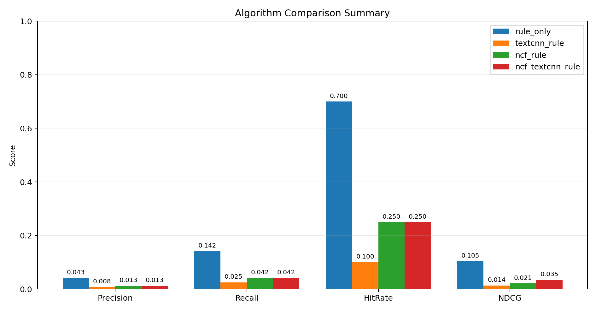
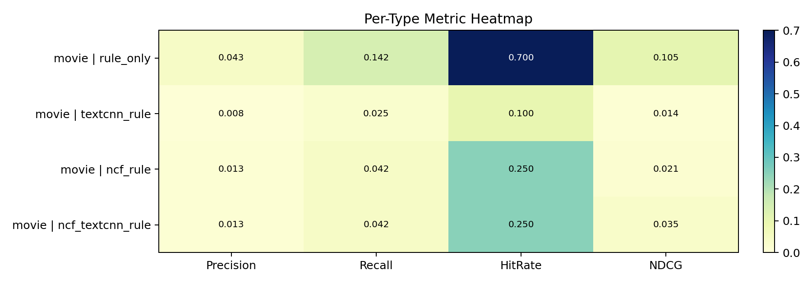

# Recommender Offline Comparison Report

- Generated at: 2026-04-26 18:33:43
- Top-K: 20
- Trials: 20
- Test ratio: 0.2
- Algorithms: rule_only, textcnn_rule, ncf_rule, ncf_textcnn_rule
- TensorFlow available: True
- TextCNN available: True
- Plot available: True

## Data Overview

- Movie items: 432
- Series items: 801
- Movie interactions: 31
- Series interactions: 17

## Summary

| type | algorithm | precision@k | recall@k | f1@k | hit_rate@k | ndcg@k | map@k | mrr@k | coverage@k | folds |
| --- | --- | --- | --- | --- | --- | --- | --- | --- | --- | --- |
| all | rule_only | 0.0425 | 0.1417 | 0.0654 | 0.7000 | 0.1047 | 0.0353 | 0.1943 | 0.1157 | 20 |
| all | textcnn_rule | 0.0075 | 0.0250 | 0.0115 | 0.1000 | 0.0136 | 0.0036 | 0.0131 | 0.5000 | 20 |
| all | ncf_rule | 0.0125 | 0.0417 | 0.0192 | 0.2500 | 0.0211 | 0.0041 | 0.0245 | 0.4838 | 20 |
| all | ncf_textcnn_rule | 0.0125 | 0.0417 | 0.0192 | 0.2500 | 0.0345 | 0.0128 | 0.0767 | 0.5579 | 20 |

## Per Type

| type | algorithm | precision@k | recall@k | f1@k | hit_rate@k | ndcg@k | map@k | mrr@k | coverage@k | folds |
| --- | --- | --- | --- | --- | --- | --- | --- | --- | --- | --- |
| movie | rule_only | 0.0425 | 0.1417 | 0.0654 | 0.7000 | 0.1047 | 0.0353 | 0.1943 | 0.1157 | 20 |
| movie | textcnn_rule | 0.0075 | 0.0250 | 0.0115 | 0.1000 | 0.0136 | 0.0036 | 0.0131 | 0.5000 | 20 |
| movie | ncf_rule | 0.0125 | 0.0417 | 0.0192 | 0.2500 | 0.0211 | 0.0041 | 0.0245 | 0.4838 | 20 |
| movie | ncf_textcnn_rule | 0.0125 | 0.0417 | 0.0192 | 0.2500 | 0.0345 | 0.0128 | 0.0767 | 0.5579 | 20 |

## Notes

- `ncf_textcnn_rule` matches the current production main path.
- `ncf_rule` approximates the fallback when TextCNN is unavailable.
- `textcnn_rule` approximates the fallback when NCF is unavailable.
- `rule_only` approximates the last fallback based on rule content similarity.
